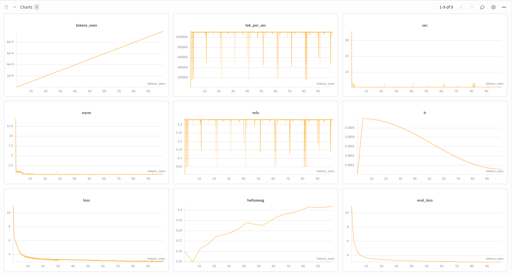

# 001 — GPT-2 Small Pretraining Baseline

**Commit:** `d95e43a`

## Reproduce

```bash
# Data prep
.venv/bin/python scripts/prep_pretrain_data.py \
    --config configs/pretraining/gpt2_small.json

# Training (8x GPUs)
.venv/bin/torchrun --nproc_per_node=8 scripts/run_train.py \
    --config configs/pretraining/gpt2_small.json
```

*Paths reflect current main. The pinned commit above uses the older flat `configs/*.json` layout.*

## Goal
Validate the training infrastructure end-to-end and establish a baseline to compare future runs against.

## Config

| Parameter | Value |
|---|---|
| Model | GPT-2 small (124M params) |
| Dataset | fineweb-edu sample-10BT |
| Tokens | 10B |
| Steps | 19073 |
| Total batch size | 524288 |
| Batch size per GPU | 32 |
| Gradient accumulation steps | 2 |
| Sequence length | 1024 |
| Max LR | 6e-4 |
| Warmup steps | 715 |
| LR schedule | Cosine decay to 6e-5 |
| Optimizer | AdamW (β1=0.9, β2=0.95, wd=0.1) |
| Grad clip | 1.0 |

## Hardware

| | |
|---|---|
| GPUs | 8x A100 40GB SXM4 (Lambda Labs, Tokyo) |
| Cost | $15.92/hr |
| MFU | 33% |
| Throughput | ~1.1M tok/sec |
| Wall clock time | 3 hours ($48) |

## Results

| Metric | This run | Reference (nanoGPT) |
|---|---|---|
| Val loss | 3.07 | 3.28 (different dataset, not directly comparable) |
| Hellaswag | 30.4% | 29.55% |

Hellaswag still trending up at end of run, but stopped here.

## Charts



## Observations

- MFU of 33% is lower than the ~50% reference. Expected: GPT-2 small is small enough that it can't keep the A100's compute units saturated, so per-step time is dominated by memory bandwidth and kernel launch overhead rather than matmul throughput.
- `torch.compile` added ~3-5% MFU improvement.
- Hellaswag at 30.4% beats the 29.55% reference, likely due to the higher quality fineweb-edu dataset vs WebText.
- Loss and eval_loss decreased cleanly with no instabilities. Final training loss 2.99, eval loss 3.07.
- This run used a pip-installed torch rather than Lambda's system torch. Lambda's cuDNN lives in a non-standard path that only their torch build knows about, so installing your own torch can bypass optimized cuDNN kernels. Subsequent runs use system torch via `make install-cluster`.
- Configuration and training recipe directly inspired by [nanoGPT](https://github.com/karpathy/nanoGPT)'s GPT-2 reproducer.

