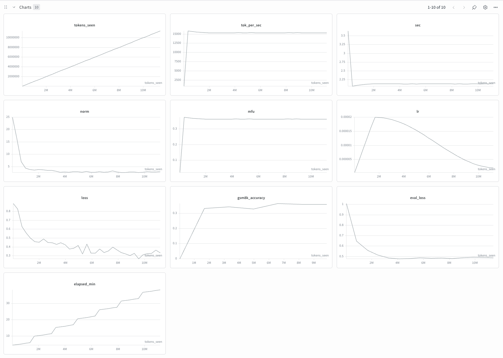
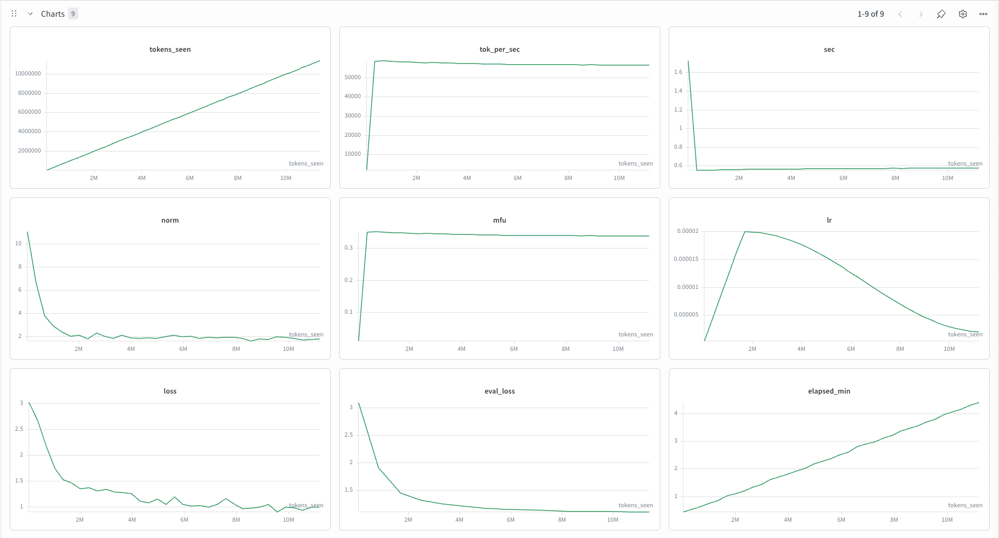

# 002 — SFT on GSM8K (Qwen 2.5-0.5B)

**Commit:** `3b0dbbb`

## Reproduce

```bash
# Data prep
.venv/bin/python scripts/prep_sft_data.py \
    --config configs/sft/qwen_0.5b_gsm8k.json --key prep_train
.venv/bin/python scripts/prep_sft_data.py \
    --config configs/sft/qwen_0.5b_gsm8k.json --key prep_val

# Training
.venv/bin/python scripts/run_train.py \
    --config configs/sft/qwen_0.5b_gsm8k.json
```

*Paths reflect current main. The pinned commit above uses the older flat `configs/*.json` layout.*

## Goal

Fine-tune Qwen 2.5-0.5B from base pretrained weights on GSM8K and measure how much math reasoning ability SFT can unlock.

## Config

| Parameter | Value |
|---|---|
| Model | Qwen/Qwen2.5-0.5B base (500M) |
| Dataset | GSM8K (train / test) |
| Tokenizer | Qwen/Qwen2.5-0.5B |
| Chat template | Native (Qwen tokenizer) |
| Tokens | ~11.4M |
| Steps | 348 |
| Total batch size | 32768 |
| Batch size per GPU | 16 |
| Gradient accumulation steps | 4 |
| Sequence length | 512 |
| Max LR | 2e-5 |
| Warmup steps | 50 |
| LR schedule | Cosine decay to 10% of max LR (2e-6) |
| Optimizer | AdamW (β1=0.9, β2=0.95, wd=0.01) |
| Grad clip | 1.0 |
| GSM8K eval every | 50 steps |
| GSM8K gen batch size | 128 |
| GSM8K max new tokens | 500 |

## Hardware

| | |
|---|---|
| GPU | 1x A10 PCIe 24GB (Lambda Labs) |
| MFU | ~36% |
| Throughput | ~15,400 tok/sec |
| Wall clock time | ~38 min |
| Cost | ~$0.82 ($1.29/hr, ~38 min) |

## Results

| Metric | Value |
|---|---|
| Final train loss | 0.33 |
| Final eval loss | 0.49 |
| GSM8K accuracy | 35.9% (477/1328, last measured at step 300) |

## Charts



## Observations

- GSM8K accuracy reaches 35.9% by step 300, with the curve still slightly climbing — suggesting the model has latent math knowledge from pretraining that SFT efficiently unlocks.
- 36% MFU on A10 PCIe is expected for a 0.5B model — small models are memory-bandwidth bound. Consistent with experiment 001 (33% MFU for 124M GPT-2 on A100).
- `torch.compile` + HF KV cache enabled for generation, making GSM8K evals fast enough to run every 50 steps without meaningful overhead.
- TF32 matmul precision enabled (`torch.set_float32_matmul_precision("high")`).

## Bonus: GPT-2 small

We also ran the same SFT procedure on our GPT-2 small from experiment 001. This serves two purposes: validating that our SFT pipeline works end-to-end on a natively pretrained model (so we can reuse it as we improve the base model), and establishing a baseline for what SFT can and cannot unlock without strong math priors from pretraining. GPT-2 has no native chat template so we used a simple hand-rolled `<|user|> / <|assistant|> / <|endoftext|>` format, with the model learning the template structure from scratch during fine-tuning.

| Metric | Value |
|---|---|
| Resume from | `checkpoints/gpt2_small/ckpt_019000.pt` |
| Final train loss | ~1.0 |
| Final eval loss | ~1.1 |
| GSM8K accuracy | N/A |

GSM8K eval was disabled for this run. The generate samples made it clear accuracy would be near 0, so running a full eval (each pass takes ~29 minutes without a KV cache in the native GPT-2 generator) wasn't worth it.

Despite the loss dropping from 3.0 to ~1.0, generation samples show the model learning GSM8K stylistic conventions (inline calculator notation `<<2*2=4>>`) but failing to produce coherent arithmetic or reach the `####` answer format. Accuracy is expected to be near zero. In this run, SFT transferred the output style but didn't teach the model math reasoning the pretrained base lacked.

**Step 0** — pure pretrained language model, no math:
> There's lots of stuff I can buy. I'm in the business. I'm not used to it. I'm just afraid to look at it and have fun and take it one step further.

**Step 300** — fully adopted the `<<operation=result>>` annotation format, but every arithmetic result is hallucinated:
> We ate 3 apples at a time for a total of 3 * 10 = <<3*10=30>>30 apples. When we ate 30, we ate 30 * 18 = <<30*18=500>>500 apples. This leaves us with 5 + 30 = <<5+30=39>>39 apples left. Since 1 apple takes 1,000, this leaves us with 39 apples - 3 apples = <<39-3=70>>70 apples left...


