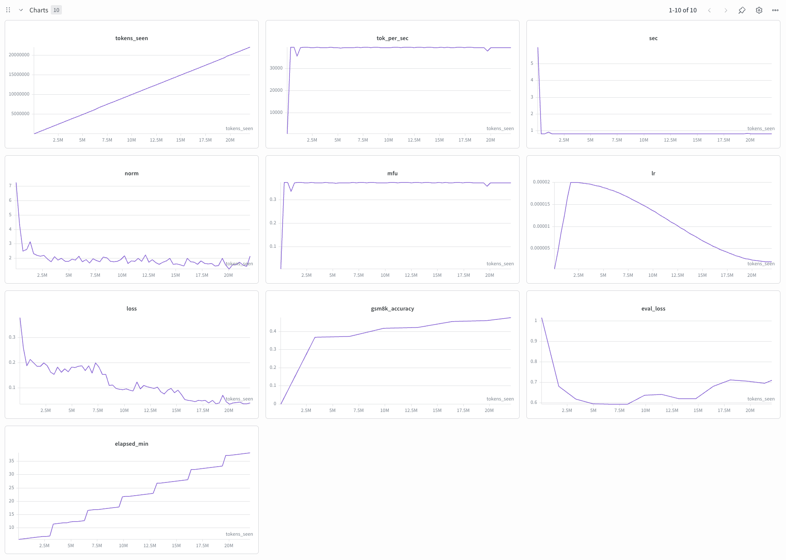

# 003 — SFT on GSM8K with teacher-distilled answers (Qwen 2.5-0.5B)

**Commit:** `682c1d2`

## Goal

Replace GSM8K's terse `<<calc=result>>` answers with step-by-step reasoning generated by a stronger math-tuned teacher (Qwen2.5-Math-7B-Instruct), then SFT the same Qwen 2.5-0.5B student on this distilled data. The question is whether richer reasoning traces improve GSM8K accuracy compared to experiment 002.

## Pipeline

Three stages:

1. **Teacher sampling.** Generate answers with `Qwen2.5-Math-7B-Instruct` via vLLM, validated against the GSM8K ground-truth numeric answer via round-robin retry (up to 8 rounds).
2. **Prep.** Re-tokenize the teacher answers into npy shards using the student tokenizer (`Qwen/Qwen2.5-0.5B`).
3. **Train.** SFT the student on the distilled data, reusing exp 002's recipe with `seq_len` and `max_steps` doubled to fit the longer answers and keep ~3 epochs.

## Stage 1 — Teacher sampling

### Config

| Parameter | Value |
|---|---|
| Teacher model | Qwen/Qwen2.5-Math-7B-Instruct |
| dtype | bfloat16 |
| Max generation tokens | 2048 |
| Temperature | 0.7 |
| System prompt | *"You are a math tutor. Solve the problem step by step, showing your full reasoning."* |
| Batch size | 64 |
| Max rounds | 8 |
| Dataset | GSM8K train (7,473 examples) |

### Round-robin retry

Each round only re-samples examples the teacher hasn't yet produced a correct numeric answer for (validated against `extract_answer`). Easy problems get solved in round 1; hard problems get up to 8 independent attempts before falling back to the original GSM8K answer. Compute scales with difficulty rather than dataset size.

### Results

| Round | Solved this round | Cumulative | % of dataset |
|---|---|---|---|
| 1 | 7098 | 7098 | 95.0% |
| 2 | 110 | 7208 | 96.5% |
| 3 | 36 | 7244 | 96.9% |
| 4 | 18 | 7262 | 97.2% |
| 5 | 10 | 7272 | 97.3% |
| 6 | 8 | 7280 | 97.4% |
| 7 | 12 | 7292 | 97.6% |
| 8 | 3 | 7295 | 97.6% |

7295 / 7473 examples ended up with a teacher answer, 178 fell back to original GSM8K. Wall clock was 45.7 min on a single A100 SXM4 40GB.

Round-robin made this ~6.5× cheaper than naive 8-round re-sampling: ~9.1k total generations vs ~59.8k if every example had been re-sampled every round. After round 1 the pending set was already 95% smaller, so rounds 2-8 cost very little.

### Answer-length comparison

Token counts on 7,473 examples (student tokenizer, Qwen2.5-0.5B):

| | Original | Teacher | Ratio |
|---|---|---|---|
| avg | 202 | 380 | 1.88× |
| p50 | 189 | 367 | 1.94× |
| p99 | 411 | 681 | 1.66× |
| max | 557 | 2230 | 4.00× |

Char counts on the final written jsonl (including the 178 fallbacks) are 997 (teacher) vs 287 (original), about 3.5×. That overstates the token ratio because the teacher's natural-language reasoning uses more characters per token than the original's dense `<<2*3=6>>` calculator notation.

### Example pair (same question)

> **Q:** *Natalia sold clips to 48 of her friends in April, and then she sold half as many clips in May. How many clips did Natalia sell altogether in April and May?*

**Original GSM8K answer:**
> Natalia sold 48/2 = `<<48/2=24>>`24 clips in May.
> Natalia sold 48+24 = `<<48+24=72>>`72 clips altogether in April and May.
> `#### 72`

**Teacher (Qwen2.5-Math-7B-Instruct) answer:**
> To determine the total number of clips Natalia sold in April and May, we need to follow these steps:
>
> 1. Find out how many clips Natalia sold in May.
> 2. Add the number of clips sold in April to the number of clips sold in May.
>
> First, we know that Natalia sold 48 clips in April. According to the problem, she sold half as many clips in May. Therefore, we calculate the number of clips sold in May as follows:
> $$\text{Clips sold in May} = \frac{48}{2} = 24$$
>
> Next, we add the number of clips sold in April to the number of clips sold in May to find the total number of clips sold:
> $$\text{Total clips sold} = 48 + 24 = 72$$
>
> Thus, the total number of clips Natalia sold in April and May is #### 72.

## Stage 2 — Prep

### Config

| Parameter | Value |
|---|---|
| Tokenizer | Qwen/Qwen2.5-0.5B |
| Max length | 1025 (vs 513 in exp 002) |
| Examples per shard | 500 |

Picked `max_length=1025` because the teacher token p99 is 681, leaving ~1.5× headroom. Going to 2049 would have doubled training cost and memory for negligible coverage gain, since ~99% of examples already fit in 1024.

### Results

| Metric | Value |
|---|---|
| Examples kept | 7,471 / 7,473 |
| Skipped (exceeded max_length=1025) | 2 (one at 1117, one at 2230) |

## Stage 3 — Training

Same setup as exp 002, with two changes: `seq_len` doubled from 512 → 1024 to fit the longer teacher answers (teacher token p99 = 681), and `max_steps` raised from 348 → 672 to keep ~3 epochs at the new token count (~22M vs ~11.4M). Everything else (LR, optimizer, schedule, batch size in tokens) is identical, so any accuracy delta is attributable to the data, not different hyperparameters.

| Parameter | Value |
|---|---|
| Model | Qwen/Qwen2.5-0.5B base (500M) |
| Tokenizer | Qwen/Qwen2.5-0.5B |
| Sequence length | 1024 (vs 512 in exp 002) |
| Tokens | ~22M (vs ~11.4M in exp 002) |
| Steps | 672 (~3 epochs) |
| Total batch size | 32768 |
| Batch size per GPU | 8 |
| Gradient accumulation steps | 4 |
| Max LR | 2e-5 |
| Warmup steps | 50 |
| LR schedule | Cosine decay to 10% of max LR (2e-6) |
| Optimizer | AdamW (β1=0.9, β2=0.95, wd=0.01) |
| Grad clip | 1.0 |
| GSM8K eval every | 100 steps |
| GSM8K gen batch size | 128 |
| GSM8K max new tokens | 500 |

## Hardware

| | Stage 1 (sampling) | Stage 3 (training) |
|---|---|---|
| GPU | 1× A100 SXM4 40GB ($1.99/hr) | 1× A100 SXM4 40GB ($1.99/hr) |
| Wall clock | 45.7 min | 38.2 min |
| MFU | — | ~37.5% |
| Throughput | — | ~39,400 tok/sec |
| Cost | ~$1.52 | ~$1.27 |

Total cost: ~$2.79

## Results

| Metric | Exp 002 (original) | Exp 003 (teacher) | Δ |
|---|---|---|---|
| Final train loss | 0.33 | 0.04 | −0.29 |
| Final eval loss | 0.49 | 0.71 | +0.22 |
| GSM8K accuracy | 35.9% | **47.65%** (629/1320) | **+11.8 pts** |

`eval_loss` went up because the val set still uses original-style GSM8K answers while training produces teacher-style step-by-step reasoning. That's an out-of-distribution loss, not a regression. GSM8K accuracy climbed regardless.

### Sample generations — exp 002 vs exp 003

Same prompt to both fine-tuned students:

> *"I have 5 boxes with 8 apples each. I eat 3 apples. How many do I have left?"*

**Exp 002 student (trained on original GSM8K):**
> I have 5 x 8 = `<<5*8=40>>`40 apples.
> I have 40 - 3 = `<<40-3=37>>`37 apples.
> `#### 37`

**Exp 003 student (trained on teacher distillation):**
> To determine how many apples I have left, we can follow these steps:
>
> 1. Calculate the total number of apples in the 5 boxes.
> 2. Subtract the number of apples I ate from the total number of apples.
>
> First, let's calculate the total number of apples in the 5 boxes. Each box contains 8 apples, so we multiply the number of boxes by the number of apples per box:
> $$ 5 \text{ boxes} \times 8 \text{ apples per box} = 40 \text{ apples} $$
>
> Next, I eat 3 apples. So, we subtract 3 apples from the total number of apples:
> $$ 40 \text{ apples} - 3 \text{ apples} = 37 \text{ apples} $$
>
> Therefore, the number of apples I have left is \(#### 37\).

Both students get this easy problem right, but the exp 003 student picks up the teacher's structure: enumerate steps, restate the problem, set up each calculation, walk through arithmetic, conclude. On harder GSM8K problems the exp 002 student's one-line shortcuts tend to break down, and the structural shift is what carries the gap.

## Observations

- We picked up +11.8 points on GSM8K with the same model and same hyperparameters. The only thing that changed was the answer format, which suggests the bottleneck in exp 002 was the terseness of the native `<<calc=result>>` annotations rather than the student's capacity.
- Compute isn't strictly matched. Exp 003 trains on ~22M tokens vs ~11.4M in exp 002, because teacher answers are ~2× longer. But exp 002's accuracy curve had mostly plateaued by the end, so extra epochs of the original data wouldn't have closed much of the gap. The win looks like data quality, not data volume.
- Round 1 of teacher sampling already solved 95% of GSM8K. Qwen2.5-Math-7B-Instruct is a strong teacher for this benchmark. The 178 examples that defeat it across all 8 rounds fall back to the original answers, so the training set stays at full 7,473.
- `eval_loss` keeps creeping up while `gsm8k_accuracy` keeps climbing. The val set still uses original terse answers, but the model now produces multi-step prose, so every prose token is a "wrong prediction" against the terse target. Loss inflates even though the final numbers come out right more often. This is the kind of case where the proxy metric and the real metric stop agreeing, and only the downstream metric is informative.
- A larger student (Qwen2.5-1.5B+) might widen the gap further. Tested in the follow-up section below.
- Same-family caveat: teacher and student share the Qwen2.5 tokenizer and pretraining lineage, so the teacher's outputs sit naturally in the student's input distribution. Some chunk of the +11.8 points might come from that alignment rather than pure reasoning content. Tested in the follow-up section below.

 
 
 

---

---

---

 
 
 

# EDITS

## Follow up 1: Does same-family caveat matter?

Re-ran the pipeline with `deepseek-ai/deepseek-math-7b-instruct` as the teacher, everything else identical. DeepSeek is a different family from Qwen (different tokenizer, different pretraining), so if the +11.8 gain was mostly from same-family alignment, this run should fall well short.

DeepSeek doesn't use `\boxed{X}` — it ends answers with prose like *"Therefore, the answer is 24."*. We extended `_normalize_answer` in `sample_teacher.py` to append `#### N` using the last number when no `\boxed{}` or `####` is present.

**Teacher sampling:**

| | Qwen-Math-7B | DeepSeek-Math-7B |
|---|---|---|
| Wall clock | 45.7 min | 19.4 min |
| Round 1 hit rate | 95.0% | 88.6% |
| Final coverage | 97.6% (7295) | 98.7% (7378) |
| Avg answer length (tokens) | 380 | 248 |

**Training result:**

| Metric | Exp 002 (original) | Exp 003 (Qwen teacher) | DeepSeek teacher |
|---|---|---|---|
| Final train loss | 0.33 | 0.04 | 0.19 |
| Final eval loss | 0.49 | 0.71 | 0.66 |
| GSM8K accuracy | 35.9% | 47.65% | **45.76%** (604/1320) |
| Wall clock | ~38 min | 38.2 min | 23.9 min |
| MFU | ~36% | ~37.5% | ~39.7% |
| Δ vs exp 002 | — | +11.8 pts | +9.9 pts |

DeepSeek's training run was much faster than exp 003 despite identical hyperparameters because it ran on top of the `bf16` + `gen_batch_size=256` eval speedup landed in commit `8cfc676`. Training curves followed the expected pattern.

**Sample at step 671** (same prompt as exp 003's):

> I have 5 boxes with 8 apples each, so I have a total of 5 * 8 = 40 apples.
>
> I eat 3 apples, so I have 40 - 3 = 37 apples left.
>
> So the answer is \$#### 37\$.

The output style matches DeepSeek's terser reasoning: two-line prose, no enumeration, plain arithmetic.

**Conclusion.** Cross-family teacher recovers ~84% of the same-family gain (+9.9 vs +11.8). Same-family alignment contributes at most ~1.9 of the 11.8 points. The structural shift to step-by-step reasoning dominates, not the tokenizer or pretraining lineage. Teacher distillation is robust to teacher choice.

## Follow up 2: Does the gain widen with a larger student?

Re-running both arms (original GSM8K and Qwen-Math teacher distillation) with `Qwen/Qwen2.5-1.5B` as the student. Same hyperparameters as the 0.5B runs, just a bigger model. `batch_size` per GPU dropped from 8 → 4 to fit the larger optimizer state on a 40GB A100. Here are the results:

|  | Original GSM8K | Qwen-Math teacher | Δ (teacher) |
|---|---|---|---|
| **0.5B** | 35.9% | 47.65% | **+11.8** |
| **1.5B** | 59.17% | **72.80%** | **+13.6** |
| Δ (size) | +23.3 | +25.2 | |

Training curves followed the expected pattern in both runs (loss decreased monotonically, accuracy plateaued by ~step 500). Charts omitted — the table conveys everything they would.

**Detailed metrics:**

| Metric | 1.5B baseline | 1.5B teacher |
|---|---|---|
| Final train loss | 0.26 | 0.07 |
| Final eval loss | 0.45 | 0.51 |
| GSM8K accuracy | 59.17% (781/1320) | 72.80% (961/1320) |
| Wall clock | 34.4 min | 48.1 min |
| MFU | ~55% | ~51% |
| Tok/sec | ~18,700 | ~17,100 |

**Findings:**

1. Both wins stack. Teacher distillation adds ~12 points at both 0.5B and 1.5B. Capacity adds ~24 points whether you use original or teacher data. The numbers behave additively.

2. The teacher gain is slightly larger at 1.5B than at 0.5B (+13.6 vs +11.8), and the capacity gain is slightly larger with teacher data than original (+25.2 vs +23.3). So a small positive interaction on top of the additive baseline.

3. MFU jumped on the larger model. 0.5B sat at ~37%, 1.5B sits at ~51-55%. Bigger model better amortizes kernel-launch overhead on the A100.

**Sample at step 671 (1.5B teacher):**

> To determine how many apples I have left after eating some, we can follow these steps:
>
> 1. Calculate the total number of apples I initially have.
> 2. Subtract the number of apples I eat from the total number of apples.
>
> First, let's calculate the total number of apples I initially have. I have 5 boxes, and each box contains 8 apples. So, we multiply the number of boxes by the number of apples per box:
> $$ 5 \times 8 = 40 $$
> This means I have 40 apples initially.
>
> Next, I eat 3 apples. So, we subtract the number of apples I eat from the total number of apples:
> $$ 40 - 3 = 37 $$
> This means I have 37 apples left.
>
> Therefore, the number of apples I have left is \(#### 37\).
