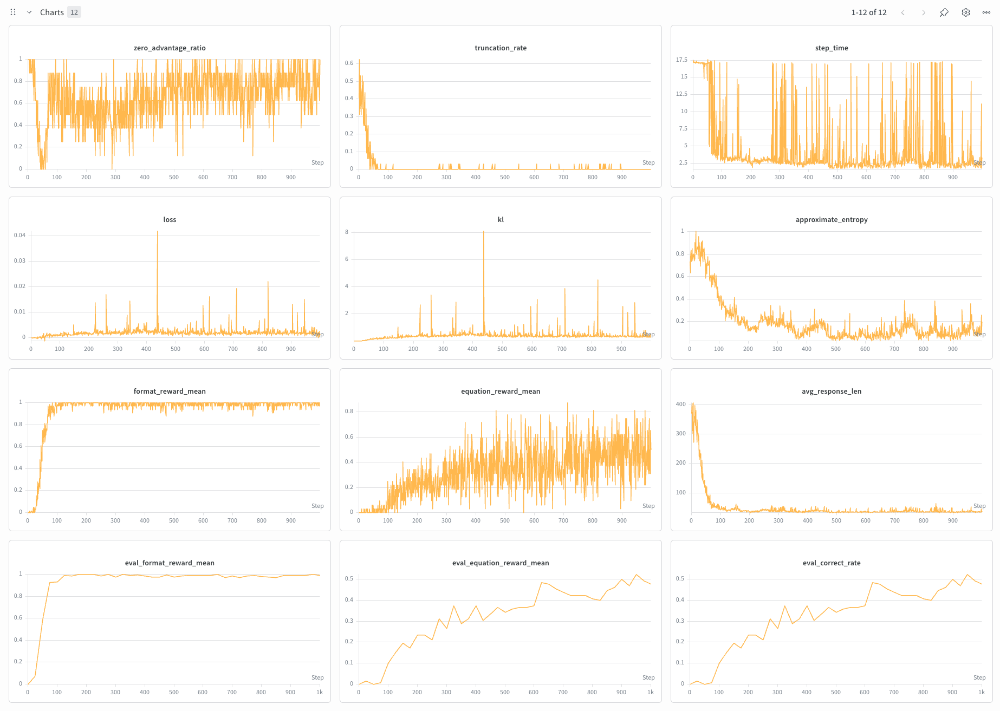

# 004 — GRPO RL on Countdown 3-num (Qwen 2.5-1.5B base)

**Commit:** `430794d`

## Reproduce

```bash
# Tokenize prompts + filter to 3-num examples
.venv/bin/python scripts/prep_rl_data.py --config configs/rl/countdown.json

# Train
.venv/bin/python scripts/run_rl_train.py --config configs/rl/countdown.json
```

## Goal

Get GRPO working end-to-end in saffron and see if it produces real learning on a reasoning task. The task is Countdown: given a few numbers, build an arithmetic expression that evaluates to a target. Run it on Qwen 2.5-1.5B base, no SFT warmup, no instruction tuning. RL straight from base weights, on a single GPU.

This experiment is motivated by [nano-aha-moment](https://github.com/McGill-NLP/nano-aha-moment), which we use as the reference for the algorithm and the task setup.

## Pipeline

Two stages: data prep, then GRPO training. The reward function is `format_reward + equation_reward`. Format checks for a strict `<think>…</think>\n<answer>…</answer>` structure (0 / 0.5 / 1). Equation is binary: parse the `<answer>` block, AST-evaluate the expression (no `eval()`), require the numbers used to match the input set, and check the result is within 1e-5 of the target.

## Stage 1 — Data prep

### Config

| Parameter | Value |
|---|---|
| Source dataset | `Jiayi-Pan/Countdown-Tasks-3to4` |
| Tokenizer | `Qwen/Qwen2.5-1.5B` |
| Filter | `num_operands = 3` (drop 4-number problems) |
| Split | last 500 → val, rest → train |
| Prompt format | system + user (`Using the numbers {nums}, create an equation that equals {target}…`) + assistant prefill (`Let me solve this step by step.\n<think>`) |

### Result

| Metric | Value |
|---|---|
| Source dataset size | 490,364 |
| After 3-num filter | 240,632 (49.1% kept) |
| Train | 240,132 |
| Val | 500 |
| Prompt token length (avg/max/p99) | 141 / 142 / 141 |

The dataset is roughly half 3-num, half 4-num, which lines up with the 49.1% retention. Prompt lengths are basically constant; the template fills with a 3-int list and a small target, so everything tokenizes to ~141 tokens.

We filtered to 3-num because the 4-num search space (~1,536 distinct flat equations vs ~96 for 3-num) is too sparse for a 1.5B model to bootstrap from. 1.5B should have enough arithmetic for 3-num; 4-num is probably too much. (We didn't ablate this formally.)

## Stage 2 — Training

Each step runs four pieces in sequence: **rollout** expands each prompt G times, generates completions with stop tokens, and builds response masks; **reward** scores each completion as `format_reward + equation_reward`; **advantage** normalizes rewards within each group of G via `(r - mean) / (std + 1e-4)` and broadcasts per-token; **loss** is the PPO clipped surrogate with a k3 KL penalty against a frozen reference, microbatched so peak memory is bounded by `microbatch_size` regardless of `B*G`.

### Config

| Parameter | Value |
|---|---|
| Model | `Qwen/Qwen2.5-1.5B` (base, 1.544B params) |
| Ref model | Same checkpoint, frozen, eval mode |
| Tokenizer | `Qwen/Qwen2.5-1.5B` |
| `num_steps` | 1000 |
| `n_prompts_per_batch` | 8 |
| `group_size` | 4 |
| `microbatch_size` | 8 |
| `max_new_tokens` | 500 |
| `temperature` | 1.0 |
| `clip_eps` | 0.2 |
| `kl_coef` | 0.005 |
| `grad_clip` | 1.0 |
| Optimizer | Fused AdamW (lr=5e-6, wd=0.0) |
| `eval_every` | 25 steps |
| `eval_n_prompts` | 32 |
| Total rollouts | 32,000 (32 completions × 1000 steps) |

`kl_coef = 0.005` was picked after an earlier failed Instruct-model run with `kl_coef = 0.05`, where KL started declining mid-run. The regularizer was pulling the policy back toward the reference faster than reward was pushing it forward. For a base model the policy needs more room to drift, so we dropped `kl_coef` by 10×.

### Hardware

| | Value |
|---|---|
| GPU | 1× A100 SXM4 40GB ($1.99/hr) |
| Wall clock | 1h 23min |
| Cost | ~$2.75 |

Memory was tight. Static (1.5B policy + ref + AdamW + grad buffer) is around 18 GB. The peak comes from the cached `old_lp` / `ref_lp` forwards, which run on the full `B*G` batch; only the training step is microbatched. With `max_new_tokens=500` and 32 sequences, the logits allocation alone is ~12 GB.

## Results

### Headline

| Metric | Step 0 (untrained) | Step 1000 (final eval) | Δ |
|---|---|---|---|
| `eval_format_reward_mean` | 0.0000 | **0.9922** | +0.99 |
| `eval_equation_reward_mean` | 0.0000 | **0.4766** | **+0.48** |
| `eval_correct_rate` | 0.0000 | **0.4766** | +0.48 |
| `eval_total_reward_mean` | 0.0000 | 1.4688 | +1.47 |

**47.66% equation correctness on 3-num Countdown, from a 1.544B base model with no SFT warmup and 32K total rollouts.**

Step 0 is zero across the board. The un-fine-tuned base model never produces output the strict regex accepts, so all of the 47.66 comes from RL.



### Trajectory shape

- **Format learning (steps 0–100).** `format_reward_mean` climbs from 0 to ~0.95 by step ~80. The base model has no chat-template prior, so this is the phase that it learns the format.
- **Equation reward emergence (steps 100–300).** Training-side `equation_reward_mean` starts showing sustained non-zero values (~0.1-0.2). Eval reward crosses 0.10 around step 200.
- **Steady learning (steps 300–1000).** Equation reward climbs from ~0.2 to ~0.45, with the noisy upward trajectory you'd expect from binary correctness over a 32-prompt eval.

### Selected step snapshots

| Step | `format_reward` | `equation_reward` | `kl` | `entropy` | `avg_response_len` | `step_time` |
|---|---|---|---|---|---|---|
| 0 | 0.00 | 0.00 | 0.0005 | 0.74 | 370 | 17.2s |
| 100 | ~0.85 | ~0.05 | ~0.06 | ~0.40 | ~110 | ~6s |
| 500 | ~1.0 | ~0.35 | ~0.20 | ~0.25 | ~50 | ~3s |
| 999 | 1.00 | 0.50 | 0.29 | 0.20 | 39 | 3.4s |

(Eval metrics from the eval-only step-1000 round; training metrics from step 999.)

## Observations

- **Base model picks up format from RL in ~100 steps.** Earlier runs with Instruct models had format saturate in 5-25 steps (Instruct already follows chat templates), but KL would then collapse and equation reward stayed at zero. The Instruct prior toward concise, formatted output seems to fight against the exploration RL needs early on. Base takes longer to learn format but then keeps going, and ironically also converges to very concise output, just via a different path.

- **No U-shape on `avg_response_len`.** DeepSeek-R1-Zero showed a U-shape on response length: it drops early then comes back up as the model learns that longer chains help. We didn't get that. Response length dropped monotonically from 370 to 39 tokens. Two likely reasons: (a) 3-num Countdown is shallow enough to solve without multi-step reasoning, so there's no reward incentive to write more; (b) 1.5B may not have the capacity for sustained long reasoning to pay off. The U-shape isn't a given; the task has to actually reward length.

- **Entropy collapsed.** `approximate_entropy` dropped from 0.74 to 0.20. The model committed to a narrow set of patterns. This is a real change in behavior, separate from KL: KL measures how far the policy drifted from the reference, entropy measures how peaked the outputs became. Both moved, but in different ways. It probably hurts generalization, but we're not measuring that here.

- **Step time fell from 17s to ~3s as the model learned to be concise.** Rollout dominates wall clock, and rollout cost scales with response length. The 6× speedup is why the whole run finished in 1h 23min instead of the 4-5h we initially budgeted.

## Notes and next steps

- **The pipeline works, but the model didn't learn to reason.** Reward signal flows, the policy learns, and equation accuracy goes from zero to 47.66%. But the 1.5B model on 3-num Countdown found a shortcut: solve directly in one pass, skip the thinking. RL rewarded it for that. The next experiment should use a bigger model (3B) and the full 3+4-num dataset to make the task hard enough that extended reasoning actually pays off.
- **Dropout assumption.** `compute_token_log_probs` is called with the policy in train mode for both `old_lp` (no-grad) and `new_lp` (with grad). For Qwen 2.5 this is fine because `attention_dropout=0`. A model with nonzero dropout would have corrupted ratios, since different dropout masks would make `old_lp[i] ≠ new_lp[i]` even at identical weights. This will be fixed.
