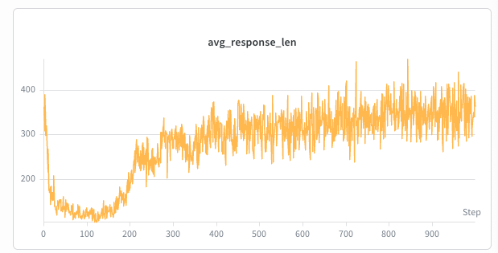
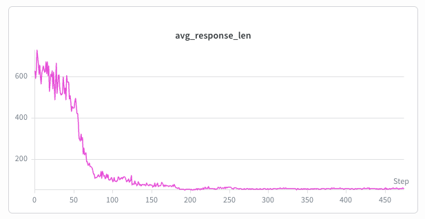
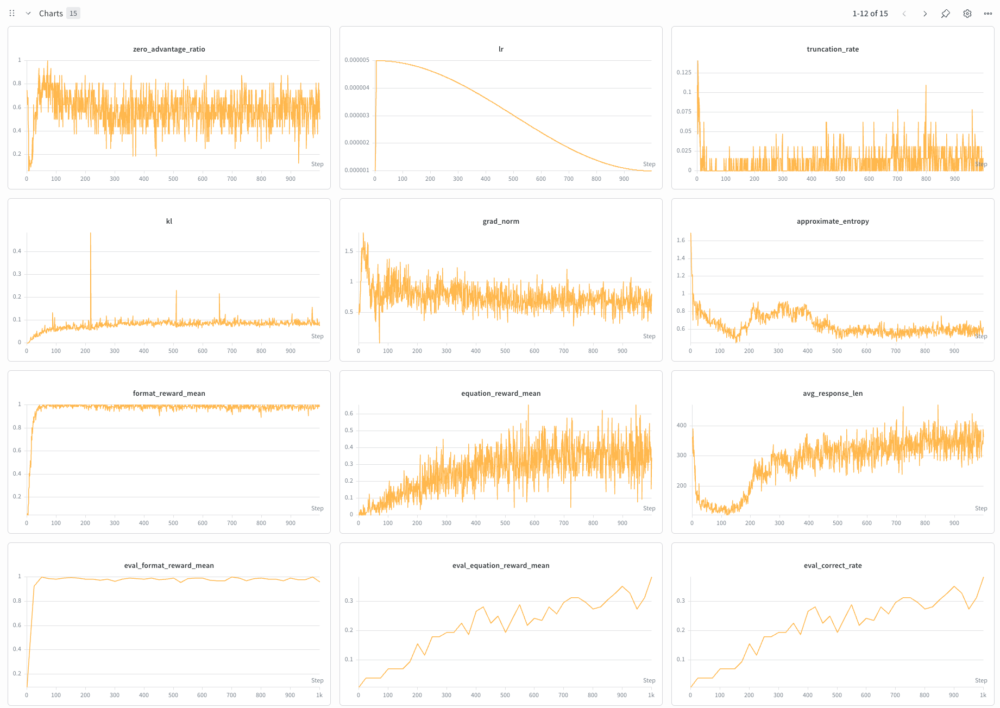

# 005 — Emergence of reasoning on Countdown via GRPO (Qwen 2.5-3B base)

**Commit:** `9eb5746`

## Reproduce

```bash
# Tokenize prompts (no num-operand filter; includes both 3-num and 4-num)
.venv/bin/python scripts/prep_rl_data.py --config configs/rl/countdown_3b.json

# Train
.venv/bin/python scripts/run_rl_train.py --config configs/rl/countdown_3b.json
```

## Goal

Experiment 004 worked. The 1.5B model got to 47.7% on 3-num Countdown. But the result was a letdown. The model didn't learn to reason. It memorized patterns and produced one-pass answers. There was nothing inside the `<think>` block that resembled thinking. Response length collapsed to ~40 tokens and stayed there. Solved the task, but in an uninteresting way.

This experiment tries to set up conditions where the model has to reason. The changes are a bigger 3B base model with more room for multi-step thinking, the harder 3+4-num Countdown mix where the 4-num search space (~16× larger) makes one-pass arithmetic unreliable, and a tighter RL pipeline that puts more gradient weight on longer correct completions. The question is whether response length will collapse and then recover (the U-shape from DeepSeek-R1-Zero), and whether the recovery completions show real trial-and-error.

The headline result is the response length curve. At 3B it collapses and then climbs back up. At 1.5B with the same pipeline it collapses and stays flat. The rest of the report unpacks how and why.

| 3B (this run) | 1.5B (same pipeline, ablation) |
|---|---|
|  |  |

## Pipeline changes from exp 004

The reward function and group-relative advantage normalization are unchanged. Five changes to the training pipeline matter.

- **Per-token loss normalization with shared `total_response_len`.** Loss is `sum(per_token_loss) / total_response_len`, where `total_response_len` is computed once over the full batch and passed to each microbatch. Each token contributes equally to the gradient, so longer correct completions get proportionally more weight. This is what implicitly pushes the model toward reasoning chains.

- **`top_p = 0.999`, `top_k = 0`.** Top-p sampling keeps the smallest set of tokens whose cumulative probability covers 99.9%. This means the model is free to explore anything in the realistic distribution, but the bottom 0.1% (mostly OOV and unused tokens in Qwen 2.5's vocab) is cut off. Top-k with a fixed cutoff like 50 is worse on both ends. It includes garbage tokens at uncertain positions where the top 50 covers a lot of low-probability mass, and it over-restricts at peaked positions where 50 tokens is overkill.

- **Cosine lr schedule (5e-6 → 1e-6).** A constant-lr ablation peaked at 0.36 eval correct rate around step 375, then declined to 0.30 by step 450. Cosine decay prevents that late-phase regression.

- **AdamW betas (0.9, 0.999).** Smoother second-moment EMA than the (0.9, 0.95) we'd been using for pretraining-style setups. Small effect.

- **Bigger effective batch (16 prompts × 4 generations = 64 episodes/iter).** More signal per gradient step. Doubles wall-clock per iteration vs exp 004 but yields cleaner gradient updates.

## Stage 1 — Data prep

Same Countdown dataset (`Jiayi-Pan/Countdown-Tasks-3to4`) and same prompt template as exp 004. The only difference is `num_operands: null`, so no filter. Both 3-num (49%) and 4-num (51%) problems are kept. Tokenized for Qwen 2.5-3B.

| Metric | Value |
|---|---|
| Source dataset | 490,364 |
| After filter | 490,364 (no filter) |
| Train | 489,864 |
| Val | 500 |
| Prompt token length (avg/max/p99) | 142 / 145 / 144 |

## Stage 2 — Training

### Config

| Parameter | Value |
|---|---|
| Model | `Qwen/Qwen2.5-3B` (base, 3.09B params) |
| Ref model | Same checkpoint, frozen, eval mode |
| Tokenizer | `Qwen/Qwen2.5-3B` |
| `num_steps` | 1000 |
| `n_prompts_per_batch` | 16 |
| `group_size` | 4 |
| `microbatch_size` | 8 |
| `max_new_tokens` | 1024 |
| `temperature` | 1.0 |
| `top_k` | 0 (disabled) |
| `top_p` | 0.999 |
| `clip_eps` | 0.2 |
| `kl_coef` | 0.001 |
| `grad_clip` | 1.0 |
| `eval_every` | 25 steps |
| `eval_n_prompts` | 32 |
| Optimizer | Fused AdamW, β=(0.9, 0.999), wd=0 |
| LR schedule | Cosine, 5e-6 → 1e-6, warmup 5 steps |
| Total rollouts | 64,000 (64 episodes × 1000 steps) |

### Hardware

| | Value |
|---|---|
| GPU | 1× GH200 96GB ($2.29/hr) |
| GPU memory used | ~93 GB / 97 GB (~95%, steady through training) |
| Wall clock | 16h 11min |
| Cost | ~$37 |

The cluster originally ran on a single A100 40GB and an H100 80GB earlier in tuning. The final run is on GH200. `max_new_tokens=1024` sat at ~93GB through the whole run, which fit on GH200 but would have OOM'd on H100 80GB.

## Results

### Headline

| Metric | Step 0 (untrained) | Step 1000 (final eval) | Δ |
|---|---|---|---|
| `eval_format_reward_mean` | 0.008 | **0.961** | +0.95 |
| `eval_equation_reward_mean` | 0.008 | **0.383** | +0.38 |
| `eval_correct_rate` | 0.008 | **0.383** | +0.38 |
| `eval_total_reward_mean` | 0.008 | 1.344 | +1.34 |

**38.3% equation correctness on Countdown 3+4-num, from a 3B base model with no SFT warmup, in 1000 steps (~64K total rollouts).**

Exp 004 reached 47.7% on the easier 3-num-only task with a 1.5B model. This run gets 38.3% on the harder mixed task. Broken down, that's roughly 60% on the 3-num subset and 15-20% on the 4-num subset, estimated from training-side numbers and not directly measured.



### Trajectory shape

Four distinct phases, visible in `avg_response_len`:

- **Format learning (steps 0–50).** `format_reward_mean` climbs from 0.008 to ~0.95. Faster than exp 004's ~80 steps thanks to `top_p` filtering out the garbage tail that broke the strict regex.
- **Collapse (steps 50–150).** `avg_response_len` drops from ~350 to ~130. The model commits to short, direct one-pass arithmetic for 3-num problems. Per-token entropy drops from ~1.2 to ~0.5. Same shortcut discovery exp 004 ended in.
- **U-recovery (steps 150–300).** `avg_response_len` climbs back to ~250–300. Multi-step reasoning chains start appearing in completions. Entropy recovers to ~0.8 because the per-token distribution gets richer. Reasoning tokens are less peaked than equation tokens. This is the phase exp 004 didn't reach.
- **Refinement (steps 300–1000).** `equation_reward` continues climbing. Cosine decay reduces effective step size, preventing late-phase regression seen in the constant-lr ablation. `eval_correct_rate` climbs steadily from ~0.20 to 0.38 with no dip.

### Selected step snapshots

| Step | `format_reward` | `equation_reward` | `kl` | `entropy` | `avg_response_len` |
|---|---|---|---|---|---|
| 0 | 0.01 | 0.00 | 0.0005 | 1.32 | 314 |
| 100 | ~0.95 | ~0.07 | ~0.05 | ~0.65 | ~130 |
| 300 | ~0.97 | ~0.20 | ~0.08 | ~0.75 | ~280 |
| 500 | ~0.97 | ~0.27 | ~0.08 | ~0.65 | ~315 |
| 999 | 0.98 | 0.34 | 0.08 | 0.63 | 364 |

### Example completion (step 999)

A 4-num problem, solved through explicit trial and error:

```
Prompt nums: [39, 37, 8, 19], target: 65

<think>
Firstly, 39 + 37 = 76. Then 76 + 8 = 84. But 84 doesn't equal to 65.
Next, 37 + 39 = 76. Then 76 + 8 = 84. Neither does this work. Let's
try 39 + 37 = 76 and then 76 - 8 = 68. Finally, if we subtract 19
from 68, we get 68 - 19 = 49. This isn't correct either. However,
I realize that 39 + 37 = 76 and if we subtract 8, we get 68. Then
if we add 19 to 68, we indeed get 68 + 19 = 87, which is still not
the answer. So, I need to find another way. Let's try 8 + 37 + 39
= 84 (which is 39 + 37 + 8), and then subtract 19, giving us 84 - 19
= 65. This fits the criteria and the numbers are used only once.
</think>
<answer>(8 + 37) + 39 - 19</answer>
```

The model checks intermediate sums, recognizes wrong answers, backtracks ("I need to find another way"), and arrives at a correct equation using each number once. Not a one-pass shortcut.

## Observations

- **The U-recovery happens at 3B but not at 1.5B.** A separate ablation ran the same pipeline (`top_p`, per-token loss, cosine decay, lr=5e-6) on Qwen 2.5-1.5B against the same 3+4-num task. Format saturated at ~1.0 by step 60. `avg_response_len` collapsed from ~600 to ~80 around step 100 and **stayed there**. No recovery, no reasoning chains. `eval_correct_rate` plateaued at ~17%. The pipeline alone isn't enough at 1.5B. Capacity matters for reasoning emergence on this task.

- **Cosine decay paid off in the late phase.** A constant-lr=5e-6 ablation peaked at `eval_correct_rate ≈ 0.36` around step 375, then declined to 0.30 by step 450. With cosine decay 5e-6 → 1e-6, the final value is 0.38 with no late-phase dip. The decay is mostly idle until step ~400. From there it shrinks updates to fine-refinement size and prevents overshoot.

- **Per-token loss normalization is what implicitly rewards reasoning.** Under the old per-sequence average, every correct completion contributed equal gradient mass regardless of length. A 50-token shortcut and a 500-token reasoning chain were equally valuable to the policy. Per-token normalization weighs every response token equally across the full batch. A correct 500-token chain contributes 10× more gradient mass than a correct 50-token shortcut. The model is implicitly rewarded for more tokens of correct work. Combined with the harder 4-num task that genuinely needs reasoning, this is what drove the U-recovery.

- **PPO clip never fired.** `clip_fraction = 0` for all 1000 steps. With one optimizer step per rollout, the policy hasn't drifted within an iteration, so `ratio ≈ 1` and the clip is a no-op. Our PPO loss is mathematically equivalent to REINFORCE in this regime.
