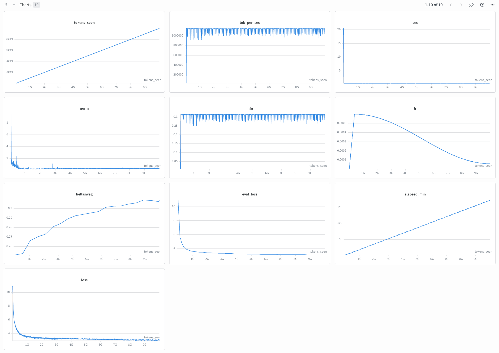
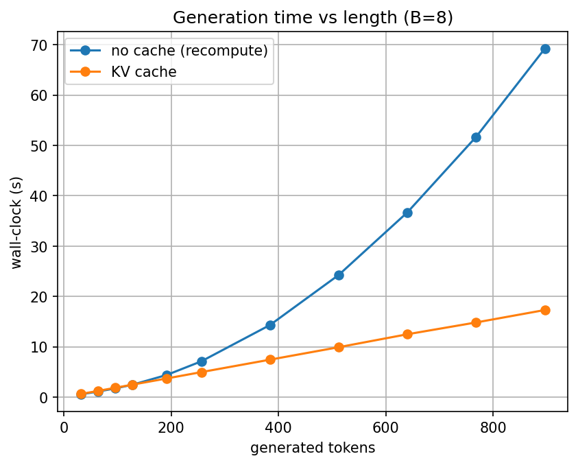

# 006 — NeoGPT: Modernizing the GPT-2 Architecture

**Commit:** `93b7800`

## Reproduce

```bash
# Data prep (gpt2 tokenizer, fineweb-edu 10BT, same shards as experiment 1)
.venv/bin/python scripts/prep_pretrain_data.py \
    --config configs/pretraining/neogpt.json

# Training (8x GPUs)
.venv/bin/python -m torch.distributed.run --nproc_per_node=8 scripts/run_train.py \
    --config configs/pretraining/neogpt.json
```

## Goal

Replace the GPT-2 stack with a Llama-style architecture, as the base for later
scaling and for efficient inference and RL rollouts. The goal is not a lower 124M
loss; the architecture gap to GPT-2 is small at this scale. The goal is a
parameter-efficient, scale-ready, inference-fast stack with no quality regression,
and to measure the efficiency gains that loss does not show.

## Changes (GPT-2 to NeoGPT)

| Component | GPT-2 | NeoGPT |
|---|---|---|
| Normalization | LayerNorm | RMSNorm |
| Positional encoding | Learned absolute | RoPE |
| MLP | GELU (4x hidden) | SwiGLU (8/3 hidden) |
| Attention | Multi-head (MHA) | Grouped-query (GQA): `n_head=12`, `n_kv_head=4` |
| Biases | Yes | None (all linears bias-free) |
| Generation | Full recompute, O(n^2) | KV cache, O(n) |
| Tokenizer | gpt2 (hardcoded) | Configurable (gpt2 here) |

Embeddings are tied (input and output share weights) in both.

## Config

| Parameter | Value |
|---|---|
| Model | NeoGPT (114M params) |
| Dataset | fineweb-edu sample-10BT |
| Tokens | 10B |
| Steps | 19073 |
| Total batch size | 524288 |
| Batch size per GPU | 32 |
| Gradient accumulation steps | 2 |
| Sequence length | 1024 |
| `n_embd` / `n_layer` / `n_head` / `n_kv_head` | 768 / 12 / 12 / 4 |
| `mlp_hidden_dim` (SwiGLU) | 2048 |
| RoPE base | 10000 |
| Max LR | 6e-4 |
| Warmup steps | 715 |
| LR schedule | Cosine decay to 6e-5 |
| Optimizer | AdamW (b1=0.9, b2=0.95, wd=0.1) |
| Grad clip | 1.0 |

## Parameter count

| Model | Params |
|---|---|
| GPT-2 small | 124,439,808 |
| NeoGPT | 114,114,048 |

NeoGPT has about 8% fewer parameters at comparable capacity. The reduction is almost
entirely from GQA shrinking the K/V projections (about 786K fewer params per layer,
times 12 layers, about 9.4M total). SwiGLU is parameter-neutral at the 8/3 hidden-dim
rule (2*768*3072 = 3*768*2048), and removed biases are negligible.

## Hardware

| | |
|---|---|
| GPUs | 8x A100 (Lambda Labs) |
| MFU | 31.3% |
| Throughput | ~1.14M tok/sec |
| Wall clock time | 2.8 hours (~$46) |

## Results

Same tokenizer, data, token budget, and recipe as experiment 1, so val loss is
directly comparable.

| Metric | GPT-2 (exp 1) | NeoGPT (this run) |
|---|---|---|
| Params | 124.4M | 114.1M (-8%) |
| Val loss | 3.07 | 3.054 |
| Hellaswag | 30.4% | 30.91% |
| Wall clock | ~3 hours | 2.8 hours |
| Final train loss | 2.99 | 2.98 |

NeoGPT matches or slightly beats GPT-2 on both metrics, at about 8% fewer parameters
and slightly faster wall clock. The quality differences (0.016 val loss, 0.5 points
Hellaswag) are small and within run-to-run noise, so the result is best read as no
regression at better efficiency, not a quality win.

## Charts



## Inference throughput

KV cache and GQA make autoregressive generation much cheaper. Benchmark of cached vs
full-recompute greedy generation at the 1B scale (`neogpt_1b.json`, single A100, B=8,
bf16, eager), sweeping generation length:



KV cache holds a constant rate of about 413 tok/s (linear, O(n) per token), while
full recompute degrades quadratically (O(n^2)):

| Generated tokens | No cache (s) | KV cache (s) | Speedup |
|---|---|---|---|
| 128 | 2.47 | 2.49 | 1.0x |
| 256 | 7.11 | 4.97 | 1.4x |
| 512 | 24.27 | 9.92 | 2.4x |
| 896 | 69.24 | 17.30 | 4.0x |

Speedup reaches 4.0x at 896 tokens and keeps growing with context length (crossover
near 128 tokens). GQA also reduces KV-cache memory by `n_head / n_kv_head = 3x`.

## Observations

- `torch.compile` works with the new ops (SwiGLU, `enable_gqa` SDPA, KV-cache
  forward) on the cluster's torch 2.x.
- RoPE's relative positions let left-padded prompts generate the same tokens as
  unpadded ones (asserted in tests); learned positional embeddings cannot.
- The tokenizer is configurable. `cl100k_base` is wired up for later math work but
  reverted to `gpt2` here so the comparison with experiment 1 is apples-to-apples;
  cross-entropy loss is not comparable across tokenizers.
- Tests pin correctness: cached vs uncached generation is asserted identical
  token-for-token (greedy), and RoPE offset, GQA grouping, and SwiGLU shapes are
  covered.
- A short Muon vs AdamW A/B on this stack did not show a wall-clock win (Muon's
  per-token edge was offset by about 15% lower MFU from the Newton-Schulz step), so
  later runs use AdamW.
